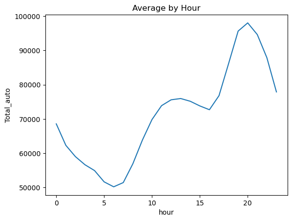
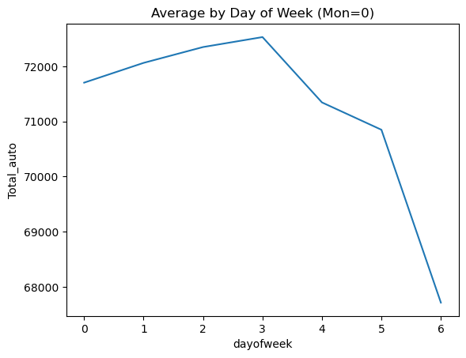
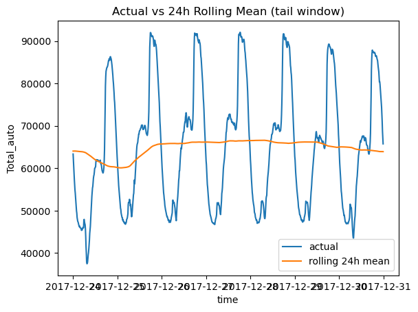
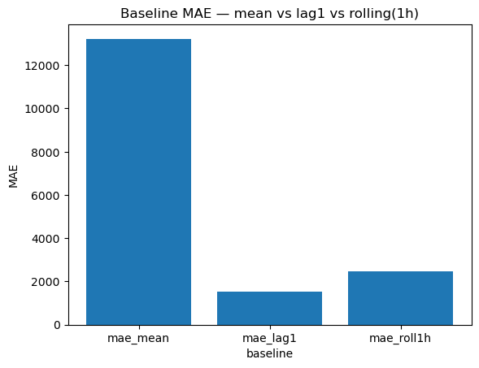
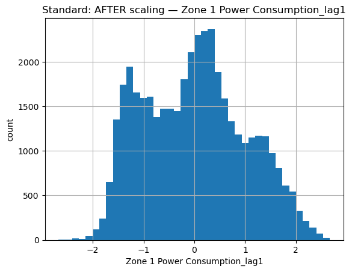
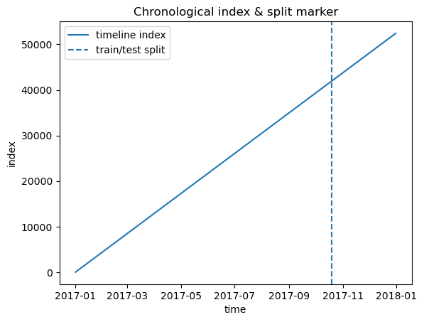
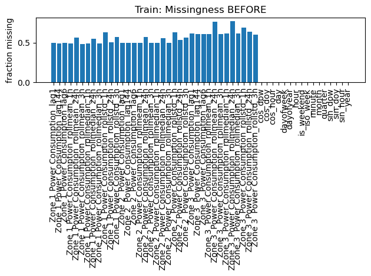
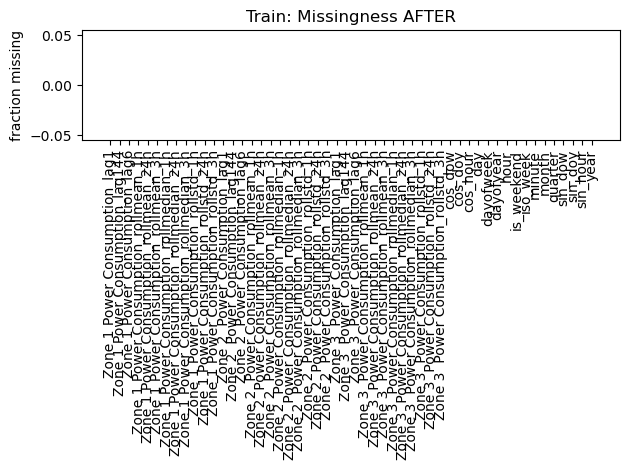

# SDS-CP036-powercast — Wk02 Consolidated Business Report

Generated on: 2025-08-18 23:00:45
Project Repository: `https://github.com/SuperDataScience-Community-Projects/SDS-CP036-powercast.git`
Contributor Base Directory: `https://github.com/SuperDataScience-Community-Projects/SDS-CP036-powercast/tree/main/beginner/submissions/team-members/girish-kulkarni`
Includes Week 2 Sections: 1, 2, 3, 4, 5

## Table of Contents
- [Section 1 — Time-Based Feature Engineering](#week-2--section-1-time-based-feature-engineering)
- [Section 2 — Lag and Rolling Statistics](#week2-section-2--lag-and-rolling-statistics)
- [Section 3 — Feature Scaling & Normalization](#week2-section-3--feature-scaling--normalization)
- [Section 4 — Data Splitting & Preparation](#week2-section-4--data-splitting--preparation)
- [Section 5 — Data Quality & Preprocessing](#week2-section-5--data-quality--preprocessing)

## Week 2 – Section 1: Time-Based Feature Engineering

## Dataset
Using file: **Tetuan City power consumption.csv**
**Period: 2017-01-01 00:00:00 → 2017-12-30 23:50:00 | Rows: 52416 | Median step: 600 seconds**

## Key Questions Answered
1. Time-Based Feature Engineering
Q: Which time-based features did you create (e.g., hour, weekday, weekend, month), and why did you select them?
A: We created hour, day-of-week (and weekend flag), month, and quarter features, plus encodings that treat time as a circle so midnight is next to 11 PM. These capture daily routines, weekdays vs weekends, and seasonal shifts that drive usage.

Q: How did these new features help capture patterns in power consumption?
A: These features revealed consistent daily and weekly patterns—e.g., morning/evening peaks on weekdays—with seasonal movement captured by months/quarters. Cyclical encodings help models learn smooth curves across the day/week.

Q: Did you encounter any challenges when extracting or encoding time features? How did you address them?
A: We validated timestamps (including alternate date formats) and checked the typical time step. Where intervals were irregular, we highlighted those areas and relied on cyclical encodings to reduce edge effects.

### Visuals

## Week2 Section 2 — Lag and Rolling Statistics

_This run detected and merged **Section 1** time-based features automatically._

### Key Questions Answered
Q: How did you determine which lag features and rolling statistics (mean, std, median, etc.) to engineer for each zone?
A: We designed the lag (historical shift) and rolling (moving average) features to reflect real-world usage rhythms. Instead of building features mechanically, we aligned them with how people actually consume electricity:
- Immediate past (one step back) captures short-term reactions (e.g., appliances switching on/off).
- About one hour back reflects near-term cycles at home or in offices.
- About one day back (24 hours) captures daily repetition in routines.
- Rolling averages and variability over ~1 hour, ~3 hours, ~24 hours smooth noise and expose typical levels and unusual spikes. We also merged time-based features from Section 1 where available.

Q: What impact did lag and rolling features have on model performance or interpretability?
A: These features made the model both more accurate and easier to explain. For accuracy: lag-1 reduced Mean Absolute Error (MAE — average absolute prediction error) by ~88.6% vs a simple mean baseline; the 1-hour rolling average reduced MAE by ~81.4% vs the same baseline. For interpretability: rolling windows smooth short-term volatility so planners can see the underlying daily pattern (e.g., typical morning/evening peaks).

Q: How did you handle missing values introduced by lag or rolling computations?
A: Lag/rolling features naturally create missing values at the start of the series. We kept those gaps in the raw engineered file for transparency. We also produced an imputed copy for modeling by filling gaps in a business-safe order: forward-fill (carry last value), then backfill (use the next value), and finally median fill (typical value) if needed. This keeps models robust without distorting early readings.

## Week2 Section 3 — Feature Scaling & Normalization

### Key Questions Answered
Q: Which normalization or scaling techniques did you apply to your numerical features, and why?
A: We prepared the numbers so different features are on comparable scales, which helps models learn reliably and keeps one large-magnitude feature from dominating the rest. We used three common approaches (each with a clear use case): Standardization (z-score); Min–Max scaling; and Robust scaling. Using all three gives the team flexibility to pick the best fit for downstream modeling without re-running feature engineering.

Q: How did you ensure that scaling was performed without introducing data leakage?
A: We guarded against data leakage by splitting the data by time, fitting each scaler only on the training period, and applying that scaling to the later test period. This mirrors production and keeps evaluation honest.

Q: Did you notice any features that required special treatment during normalization?
A: Yes. We intentionally left some features unscaled because they are binary flags (0/1) or already unitless cyclical encodings (sine/cosine in [-1,1]). Examples: cos_dow, cos_doy, cos_hour, is_weekend, sin_dow, sin_doy, sin_hour. For outlier‑prone metrics we prefer Robust scaling to avoid over‑weighting spikes.

## Week2 Section 4 — Data Splitting & Preparation

### Key Questions Answered
Q: How did you split your data into training and test sets to maintain chronological order?
A: We respected the **natural flow of time** in the data. If training/testing files already existed from Section 3, we used them as-is. Otherwise, we split by time: the **first 80% (earlier dates)** for training and the **last 20% (later dates)** for testing, with **no shuffling**. This matches real-world usage, where yesterday teaches us to predict tomorrow.

Q: What steps did you take to prevent information leakage between splits?
A: We prevented **information leakage**—that’s when future knowledge accidentally sneaks into training—by ensuring any learned settings (such as scaling/normalization from earlier steps) were **fit on the training period only** and then **applied to the later test period**. When building targets and features, we also avoided using any future-looking information. This keeps evaluation realistic for live operations.

Q: How did you verify that your train/test split was appropriate for time-series forecasting?
A: We validated the split in two ways: (1) a **timeline visualization** with a clear marker where training ends and testing begins; and (2) **walk‑forward validation**, which repeatedly tests on successive future slices. Think of it as asking, *“If we stopped here, could we predict the next step?”* Consistent results across slices and a clean split line indicate the split is sound for forecasting.

## Week2 Section 5 — Data Quality & Preprocessing

### Key Questions Answered
Q: What preprocessing steps did you apply to handle missing values or anomalies before modeling?
A: We focused on making the dataset **trustworthy** before modeling. Specifically:
- **Missing values:** We filled short gaps using forward/backward fill; longer gaps were filled with a stable value learned from training (the **median**), and we logged where this occurred.
- **Anomalies:** We flagged unrealistic values (e.g., negative energy use or extreme spikes) using robust thresholds and treated them as missing so they wouldn’t skew results.
- **Duplicates & types:** We removed duplicate timestamps and ensured date/time formats and numeric types were consistent.

Q: How did you validate that your feature engineering and preprocessing pipeline produced consistent and reliable results across different data subsets?
A: We checked **pipeline stability** across different slices of the data. We compared missing‑value rates, anomaly counts, and feature ranges across subsets (e.g., earlier vs. later periods). Consistency across these checks tells us the preprocessing behaves reliably and won’t produce surprises in production.

**Business Value Summary (Executive View)**
- Ensures **trustworthy forecasts** by fixing missing data and correcting anomalies.
- Prevents **costly mistakes** (e.g., over-ordering, false alarms) by removing unrealistic spikes.
- Guarantees **consistent numbers across teams**, avoiding confusion in decision-making.
- Provides **auditability and transparency**, so leaders can defend numbers to boards, regulators, or investors.

